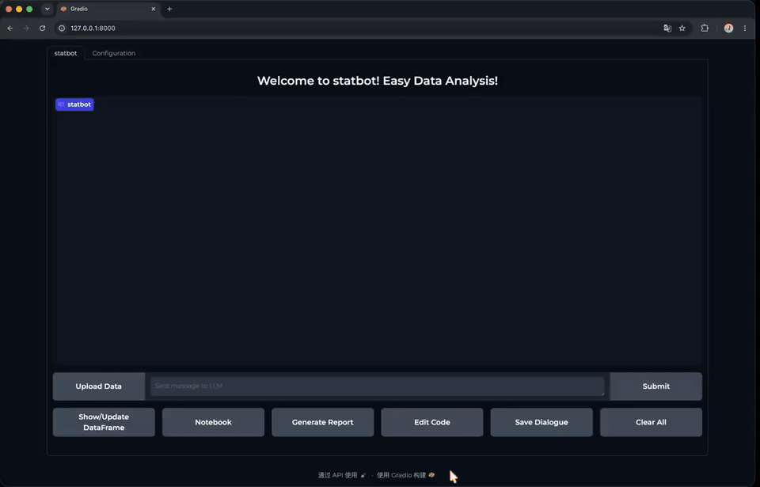

# StatBot

[English](README.md) | **简体中文**

`StatBot` 是一个以统计学为核心的数据分析智能体，为《人工智能导论》课程期末项目而开发。本项目基于原始 `LAMBDA` 项目构建——`LAMBDA` 是一个基于大语言模型的数据智能体，支持自然语言驱动的数据分析与代码执行。

## 演示视频

GitHub 仓库 README 无法稳定内嵌播放本地 `mp4` 文件，因此项目页面使用下方动图预览。点击预览可打开完整演示视频：

[](docs/statbot_demo.mp4)

- 完整演示视频：[docs/statbot_demo.mp4](docs/statbot_demo.mp4)

## 项目背景

原始 `LAMBDA` 项目探索如何利用大语言模型辅助用户进行数据分析：将自然语言请求转化为可执行代码，在 Jupyter 内核中运行，并通过交互式界面返回结果。其核心思路是将对话式智能与可复现的执行环境相结合，使用户无需手动编写每一行代码即可与数据交互。

在此基础上，本项目聚焦 **AI + 统计学** 方向，目标是使系统更适用于描述性分析、假设检验、回归建模与统计报告等统计分析任务。

## 主要改动

相比原始 `LAMBDA` 工作流，本项目增加了若干实用改进，使智能体更适合课程项目与真实统计分析场景：

### 1. 面向统计学的内置工具

我们新增了结构化的内置工具注册表，覆盖常见统计分析任务，使智能体可以直接将请求路由到更稳定的分析模板，而不仅依赖自由形式的代码生成。

当前支持的统计能力包括：

- 数据概览与描述性统计
- 缺失值分析
- 异常值筛查
- 正态性检验
- t 检验
- Wilcoxon 符号秩检验
- Mann-Whitney U 检验
- 方差分析（ANOVA）
- Kruskal-Wallis 检验
- 卡方检验
- Fisher 精确检验
- 两比例检验
- 相关分析
- OLS 回归
- 逻辑回归
- 趋势分析与可视化

### 2. 更好的上下文与记忆管理

我们增加了会话级状态追踪，使智能体能够记住：

- 已上传文件与数据集摘要
- 近期请求
- 已选统计工具
- 执行历史
- 生成的产物（如 notebook、报告、图表）

这使系统在多步分析会话中保持更连贯的行为。

### 3. 会话安全的前端行为

我们修复了前后端会话隔离问题。每个浏览器会话现在拥有独立的 `StatBot` 实例，避免「编辑代码」等功能误显示其他会话的代码。

### 4. 模型超时时的优雅降级

当外部 LLM 服务超时时，系统不再在代码执行成功后完全失败，而是：

- 仍展示成功的分析结果
- 为用户生成本地降级摘要
- 报告生成回退至本地 Markdown 报告

这使系统在演示与课堂使用中更加稳健。

### 5. 改进的前端交互流程

我们改进了以下 UI 侧行为：

- 上传状态反馈
- 更清晰的错误展示
- Notebook 导出
- 对话保存
- 报告生成反馈

## 安装

首先克隆仓库并进入项目目录：

```bash
git clone <your-repository-url>
cd statbot
```

建议在干净环境中使用 Python `3.10`。

若使用 Conda：

```bash
conda create -n statbot python=3.10
conda activate statbot
```

然后安装依赖：

```bash
pip install -r requirements.txt
```

安装用于代码执行的本地 Jupyter 内核：

```bash
ipython kernel install --name python3 --user
```

## 配置

编辑 [config.yaml](config.yaml)，配置要使用的模型端点。

当前默认配置使用 OpenAI 兼容 API 格式：

```yaml
conv_model : "qwen-max"
programmer_model : "qwen-max"
inspector_model : "qwen-max"
api_key : "${OPENAI_API_KEY}"
base_url_conv_model : "https://dashscope.aliyuncs.com/compatible-mode/v1"
base_url_programmer : "https://dashscope.aliyuncs.com/compatible-mode/v1"
base_url_inspector : "https://dashscope.aliyuncs.com/compatible-mode/v1"
```

你可以：

1. 在 shell 环境变量中设置 API Key，或
2. 在本地将占位符替换为你的 Key

推荐使用环境变量：

```bash
export OPENAI_API_KEY="your_api_key_here"
```

## 运行

启动 Web 应用：

```bash
IPYKERNEL=python3 python statbot_app.py
```

然后在浏览器中打开终端显示的 Gradio 本地地址，通常为：

```text
http://127.0.0.1:8000
```

若端口 `8000` 被占用，应用会自动切换到 `8001` 等其他本地端口。

## 示例数据

项目包含用于测试的演示数据集：

- [demo_data/ecommerce_demo.csv](demo_data/ecommerce_demo.csv)

上传后可尝试如下提示词：

- `请读取这个数据集，告诉我有多少行和多少列。`
- `按地区分析销售收入和利润。`
- `对数值变量进行相关分析。`
- `为 profit 拟合 OLS 回归模型。`

## 技术文档

项目技术文档见：

- [docs/project_technical_report.md](docs/project_technical_report.md)
- [技术文档.md](技术文档.md)（中文）

## 许可证

本项目采用 MIT 许可证，详见 [LICENSE](LICENSE)。
